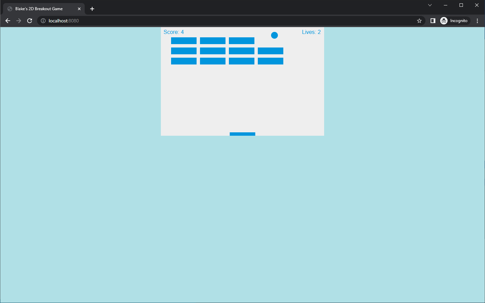

# 2D Breakout Game Using Pure JavaScript

This project is an implementation of the classic Breakout game in 2D using pure JavaScript. This version has been enhanced to run on a Node.js server, and a Dockerfile is included for containerized deployment.

## Screenshot

Here's what the game looks like:



## How to Play

1. Clone the repository to your local machine.
2. Navigate to the project directory in your terminal.
3. Run `npm install` to install the necessary npm packages.
4. Start the game server with `npm run start`.
5. Once the server is running, open your browser and go to `http://localhost:8080`.

## Features

- 2D Graphics rendered on HTML5 `<canvas>`
- Keyboard controls for paddle movement
- Collision detection algorithms
- Score tracking and lives counter
- Sound effects for game interactions
- Node.js server setup for a more robust game deployment

## Tutorial Reference

The initial structure of the game was built following the MDN Web Docs tutorial. It has been modified to include server functionality and containerization:

[2D Breakout Game Using Pure JavaScript Tutorial](https://developer.mozilla.org/en-US/docs/Games/Tutorials/2D_Breakout_game_pure_JavaScript)

## Docker Deployment

The `Dockerfile` provided in this repository allows you to deploy the game in a Docker container. The `Dockerfile` is set up with the following specifications:

- Based on `node:14-alpine3.12`
- App directory set to `/usr/src/app`
- Installation of npm dependencies
- Exposes port 8080
- Starts the game using `npm run start`

To deploy the game using Docker, run the following commands:

```sh
docker build -t breakout-game .
docker run -p 8080:8080 breakout-game
